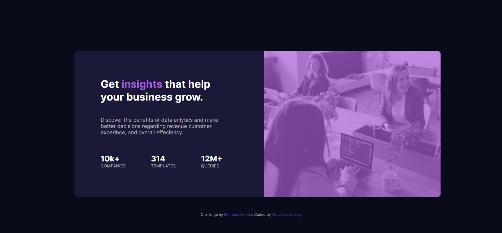

# Frontend Mentor - Stats preview card component solution

This is a solution to the [Stats preview card component challenge on Frontend Mentor](https://www.frontendmentor.io/challenges/stats-preview-card-component-8JqbgoU62). Frontend Mentor challenges help you improve your coding skills by building realistic projects. 

## Table of contents

- [Frontend Mentor - Stats preview card component solution](#frontend-mentor---stats-preview-card-component-solution)
  - [Table of contents](#table-of-contents)
  - [Overview](#overview)
    - [The challenge](#the-challenge)
    - [Screenshot](#screenshot)
    - [Links](#links)
  - [My process](#my-process)
    - [Built with](#built-with)
    - [What I learned](#what-i-learned)
    - [Continued development](#continued-development)
  - [Author](#author)

## Overview

### The challenge

Users should be able to:

- View the optimal layout depending on their device's screen size

### Screenshot



### Links

- Solution URL: (https://abdulazizbahaj.github.io/stats-preview-card-component-main/)
- Live Site URL: (https://www.frontendmentor.io/challenges/stats-preview-card-component-8JqbgoU62)

## My process

### Built with

- Semantic HTML5 markup
- CSS custom properties
- Flexbox
- CSS Grid
- Mobile-first workflow

### What I learned

I have learned a lot from this project, after this project i have developed a strong understanding of the basics.

To see how you can add code snippets, see below:

```html
<h1>Some HTML code I'm proud of</h1>
```
```css
@media screen and (max-width: 700px) {
}
```
```css
:root {
    --color-main-background: hsl(233, 47%, 7%);
    --color-card-background: hsl(244, 38%, 16%);
    --color-accent: hsl(277, 64%, 61%);
    --color-white-opaque: hsl(0, 0%, 100%);
    --color-white-transparent75: hsla(0, 0%, 100%, 0.75);
    --color-white-transparent60: hsla(0, 0%, 100%, 0.6);
}
```
```css
.image {
order: 2;
}
```

### Continued development

I want to continue on completing new challenges, it will help me to fully understand HTML, CSS, and JavaScript. 

## Author

- Linkedin - [Abdulaziz Ba Haj](https://www.linkedin.com/in/abdulaziz-bahaj?lipi=urn%3Ali%3Apage%3Ad_flagship3_profile_view_base_contact_details%3BFwF85v7zQTKFiGjzb6Hl4A%3D%3D)
- Frontend Mentor - [@AbdulazizBaHaj](https://www.frontendmentor.io/profile/AbdulazizBaHaj)
- Twitter - [@AbdulazizBaHaj_](https://twitter.com/AbdulazizBaHaj_)